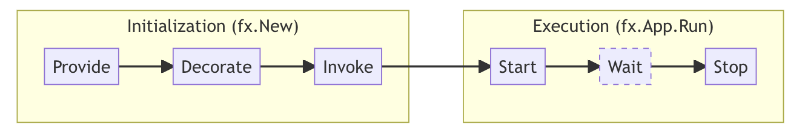

## Introduction 💉

Generating code on Golang is not my interest, but this framework is really nice and easily can generate useful binding.
These frameworks can do the dependency injection without code generation, and I kinda like them:

-   [samber/do](https://github.com/samber/do)
-   [google/wire](https://github.com/google/wire)

## [Fx](https://github.com/uber-go/fx)

> Dependency injection system for Go.

**Eliminate globals**: Fx helps you remove global state from your application. No more init() or global variables. Use Fx-managed singletons.

**Code reuse**: Fx lets teams within your organization build loosely-coupled and well-integrated shareable components.

**Battle-tested**: Fx is the backbone of nearly all Go services at Uber.

We built an empty Fx application by calling `fx.New` with no arguments.
Applications will normally pass arguments to `fx.New` to set up their components.

We then run this application with the `App.Run` method. This method blocks until it receives a signal to stop,
and it then runs any cleanup operations necessary before exiting.

Fx is primarily intended for long-running server applications; these applications typically receive a signal from the deployment system when it's time to shut down.

An App is a modular application built around dependency injection. Most users will only need to use the New constructor and the all-in-one Run convenience method. In more unusual cases, users may need to use the Err, Start, Done, and Stop methods by hand instead of relying on Run.

In addition to that built-in functionality, users typically pass a handful of **Provide** options and one or more **Invoke** options. The Provide options teach the application how to instantiate a variety of types, and the Invoke options describe how to initialize the application.

When created, the application immediately executes all the functions passed via Invoke options. To supply these functions with the parameters they need, the application looks for constructors that return the appropriate types; if constructors for any required types are missing or any invocations return an error, the application will fail to start (and Err will return a descriptive error message).

Once all the invocations (and any required constructors) **have been called**, New returns and the application is ready to be started using `Run` or `Start` . On startup, it executes any OnStart hooks registered with its Lifecycle.

```go
func Provide(lc fx.Lifecycle, store *urlsvc.URLSvc, logger *zap.Logger, tele telemetry.Telemetery) *echo.Echo {
 app := echo.New()

 handler.URL{
  Store:  store,
  Logger: logger.Named("handler").Named("url"),
  Tracer: tele.TraceProvider.Tracer("handler.url"),
 }.Register(app.Group("/api"))

 handler.Healthz{
  Logger: logger.Named("handler").Named("healthz"),
  Tracer: tele.TraceProvider.Tracer("handler.healthz"),
 }.Register(app.Group(""))

 lc.Append(
  fx.Hook{
   OnStart: func(_ context.Context) error {
    go func() {
     if err := app.Start(":1378"); !errors.Is(err, http.ErrServerClosed) {
      logger.Fatal("echo initiation failed", zap.Error(err))
     }
    }()

    return nil
   },
   OnStop: app.Shutdown,
  },
 )

 return app
}
```

### Application lifecycle

The lifecycle of a Fx application has two high-level phases: _initialization_ and _execution_.
Both of these, in turn are comprised of multiple steps.

During **initialization**, Fx will,

-   register all constructors passed to `fx.Provide`
-   register all decorators passed to `fx.Decorate`
-   run all functions passed to `fx.Invoke`, calling constructors and decorators as needed

During **execution**, Fx will,

-   Run all startup hooks appended to the application by providers, decorators, and invoked functions
-   Wait for a signal to stop running
-   Run all shutdown hooks appended to the application



### Lifecycle hooks

Lifecycle hooks provide the ability to schedule work to be executed by Fx,
when the application starts up or shuts down. Fx provides two kinds of hooks:

-   _Startup hooks_, also referred to as `OnStart` hooks. These run in the order they were appended.
-   _Shutdown hooks_, also referred to as `OnStop` hooks. These run in the **reverse** of the order they were appended.

Typically, components that provide a startup hook also provide a corresponding shutdown hook to release the resources they acquired at startup.

Fx runs both kinds of hooks with a hard timeout enforcement (by default, 15 seconds).
Therefore, hooks are expected to block only as long as they need to _schedule_ work. In other words,

-   hooks **must not** block to run long-running tasks synchronously
-   hooks **should** schedule long-running tasks in background go routines
-   shutdown hooks **should** stop the background work started by startup hooks

### Modules

A Fx module is a shareable Go library or package that provides self-contained functionality to a Fx application.

### Parameter Structs

Fx constructors declare their dependencies as function parameters.
This can quickly become unreadable if the constructor has a lot of dependencies.

```go
func NewHandler(users *UserGateway, comments *CommentGateway, posts *PostGateway,
    votes *VoteGateway, authz *AuthZGateway) *Handler {
	// ...
}
```

To improve the readability of constructors like this, create a struct that lists all the dependencies as
fields and change the function to accept that struct instead. The new struct is called a parameter struct.

Fx has first class support for parameter structs: any struct embedding `fx.In` gets treated as a parameter struct, so the individual fields in the struct are supplied via dependency injection.
Using a parameter struct, we can make the constructor above much more readable:

```go
type HandlerParams struct {
	fx.In

	Users    *UserGateway
	Comments *CommentGateway
	Posts    *PostGateway
	Votes    *VoteGateway
	AuthZ    *AuthZGateway
}

func NewHandler(p HandlerParams) *Handler {
	// ...
}
```

### Result Structs

Result structs are the inverse of parameter structs. These structs represent multiple outputs from a
single function as fields. Fx treats all structs embedding `fx.Out` as result structs, so other constructors can
rely on the result struct's fields directly.

Without result structs, we sometimes have function definitions like this:

```go
func SetupGateways(conn *sql.DB) (*UserGateway, *CommentGateway, *PostGateway, error) {
  // ...
}
```

With result structs, we can make this both more readable and easier to modify in the future:

```go
type Gateways struct {
  fx.Out

  Users    *UserGateway
  Comments *CommentGateway
  Posts    *PostGateway
}

func SetupGateways(conn *sql.DB) (Gateways, error) {
  // ...
}
```

Result struct can be used for configuration to load it at once and distribute it between modules. The following structure contains all the application configuration:

```go
// Config holds all configurations.
type Config struct {
	fx.Out

	Database  db.Config        `json:"database"  koanf:"database"`
	Logger    logger.Config    `json:"logger"    koanf:"logger"`
	Telemetry telemetry.Config `json:"telemetry" koanf:"telemetry"`
	Generator generator.Config `json:"generator" koanf:"generator"`
}
```

The configuration is loaded using a single function (the following example uses `koanf` to load configuration from defaults, configuration file and environment variables):

```go
func Provide() Config {
	k := koanf.New(".")

	// load default configuration from default function
	if err := k.Load(structs.Provider(Default(), "koanf"), nil); err != nil {
		log.Fatalf("error loading default: %s", err)
	}

	// load configuration from file
	if err := k.Load(file.Provider("config.toml"), toml.Parser()); err != nil {
		log.Printf("error loading config.toml: %s", err)
	}

	// load environment variables
	if err := k.Load(
		// replace __ with . in environment variables so you can reference field a in struct b
		// as a__b.
		env.Provider(prefix, ".", func(source string) string {
			base := strings.ToLower(strings.TrimPrefix(source, prefix))

			return strings.ReplaceAll(base, "__", ".")
		}),
		nil,
	); err != nil {
		log.Printf("error loading environment variables: %s", err)
	}

	var instance Config
	if err := k.Unmarshal("", &instance); err != nil {
		log.Fatalf("error unmarshalling config: %s", err)
	}

	indent, err := json.MarshalIndent(instance, "", "\t")
	if err != nil {
		panic(err)
	}

	indent = pretty.Color(indent, nil)

	log.Printf(`
================ Loaded Configuration ================
%s
======================================================
	`, string(indent))

	return instance
}
```

and then distributed configuration between modules:

```go
// Config contains the database configuration.
type Config struct {
	Name string `json:"name" koanf:"name"`
	URL  string `json:"url"  koanf:"url"`
}

func Provide(lc fx.Lifecycle, cfg Config) (*mongo.Database, error) {
}
```
