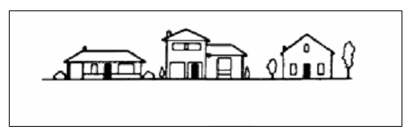
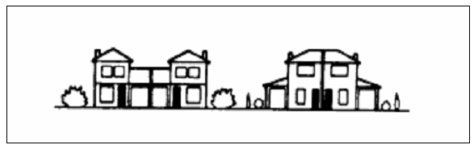
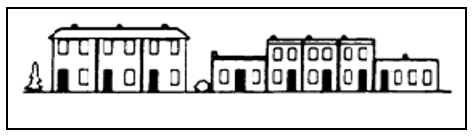

## Introduction

Where someone lives. **Houses, apartments, and condos** are all dwellings.

- [List of house types](https://en.wikipedia.org/wiki/List_of_house_types)
- [Type of Dwelling Reference Guide, Census of Population, 2021](https://www12.statcan.gc.ca/census-recensement/2021/ref/98-500/001/98-500-x2021001-eng.cfm)

The biggest difference between a condo and an apartment is ownership.
An [apartment](https://www.bankrate.com/real-estate/what-is-an-apartment/)
is defined as a residence that is rented, often as part of a larger residential building.
A [condo](https://www.bankrate.com/real-estate/what-is-a-condo/) can be similar in structure
to an apartment — usually a unit within a larger residential building — but condos are owned instead of rented.
The [property taxes](https://www.bankrate.com/real-estate/property-taxes/)
of a condo are paid by the owner; property taxes for an apartment are paid by landlords, not renters.

### Apartment / Condo

A self-contained [housing unit](https://en.wikipedia.org/wiki/Housing_unit)
(a type of residential [real estate](https://en.wikipedia.org/wiki/Real_estate))
that occupies part of a building, generally on a single story.

### Residential

House (Detached) / Townhouse (End Row, In Row) / Semi-Detached / Duplex

#### Single-detached house (Code 1)

A single dwelling not attached to any other dwelling or structure (except its own garage or shed).
A single-detached house has open space on all sides, and has no dwellings either above or below it.

#### Semi-detached house (Code 2)

One of two dwellings attached side by side (or back to back) to each other,
but not to any other dwelling or structure (except its own garage or shed).
A semi-detached dwelling has no dwellings either above or below it,
and the two units together have open space on all sides.

#### Row house (Code 3)

One of three or more dwellings joined side by side (or occasionally side to back),
such as a townhouse or garden home, but not having any other dwellings either above or below.

