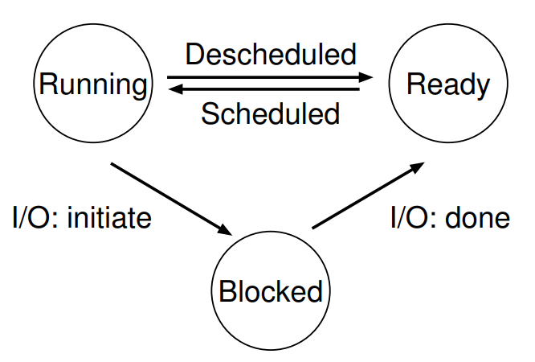

## Process

Process is the **running program**.
The program itself is a lifeless thing: it just sits there on the disk, a bunch of instructions
(and maybe some static data), waiting to spring into action.

**Time sharing** is a basic technique used by an OS to share a resource.
By allowing the resource to be used for a little while by one entity, and
then a little while by another, and so forth, the resource in question (e.g., the
CPU, or a network link) can be shared by many.
The counterpart of time sharing is **space sharing**, where a resource is divided (in space)
amon those who whish to use it.
For example, disk space is naturally a space-shared resource; once a block is assigned to a file,
it is normally not assigned to another file until the user deletes the original file.

### Registers

The **Program Counter (PC)** (sometimes called the **instruction pointer (IP)**) tells us which instruction of the program
will execute next; similarly a **stack pointer** and associated **frame pointer** are used to manage the stack for function
parameters, local variables, and return addresses.

### APIs

These APIs, in some form, are available on any modern operating system.

- Create
- Destroy
- Wait
- Miscellaneous Control
- Status

### Process Creation

In early (or simple) operating systems, the loading process is done **eagerly**, i.e., all at once before running the program; modern OSes perform
the process **lazily**, i.e., by loading pieces of code or data only as the are needed during program execution.
Once the code and static data are loaded into memory, there are a few other things the OS needs to do before running the process.

Some memory must be allocated for the program's **run-time stack** (or just **stack**). C programs use the stack for local variables,
function parameters, and return addresses; the OS allocates this memory and gives it to the process.

The OS may also allocate some memory for the program's **heap**. In C
programs, the heap is used for explicitly requested dynamically-allocated data;
programs request such space by calling `malloc()` and free it explicitly by calling `free()`.

### Process States

In a simplified view, a process can be in one of three states:

- **Running**: In the running state, a process is running on a processor. This means it is executing instructions.
- **Ready**: In the ready state, a process is ready to run buf for some reason the OS has chosen not to run it at this given time.
- **Blocked**: In the blocked state, a process has performed some kind of operation that makes it not ready to run until some other
  event takes place. A common example: when a process initiates an I/O request to a disk, it becomes blocked and thus some other process
  can use the processor.

## Policy and Mechanism

Separate high-level policies from low-level mechanisms.
Policies answer **Which** questions and mechanisms answer **How** questions.
