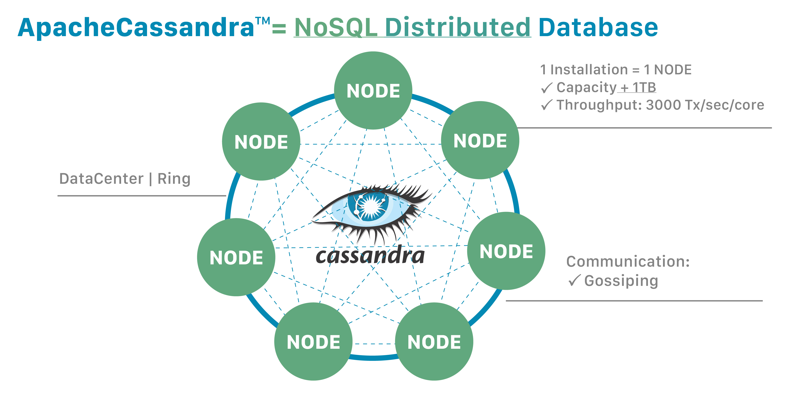

> Cassandra is a NoSQL distributed database.

## Distribution provides power and resilience

One important Cassandra attribute is that its databases are distributed. That yields both technical and business advantages.
Cassandra databases easily scale when an application is under high stress, and the distribution also prevents data loss from
any given datacenter's hardware failure. A distributed architecture also brings technical power;
for example, a developer can tweak the throughput of read queries or write queries in isolation.

"Distributed" means that Cassandra can run on multiple machines while appearing to users as a unified whole.
There is little point in running Cassandsra as a single node, although it is very helpful to do so to help
you get up to speed on how it works. But to get the maximum benefit out of Cassandra, you would run it on multiple machines.

Since it is a distributed database, Cassandra can (and usually does) have multiple nodes. A node represents a single instance of Cassandra. These nodes communicate with one another through a protocol called gossip, which is a process of computer peer-to-peer communication. Cassandra also has a masterless architecture – any node in the database can provide the exact same functionality as any other node – contributing to Cassandra’s robustness and resilience. Multiple nodes can be organized logically into a cluster, or "ring". You can also have multiple datacenters.
