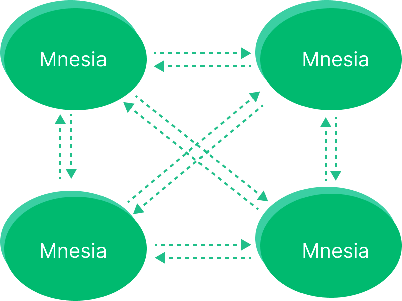
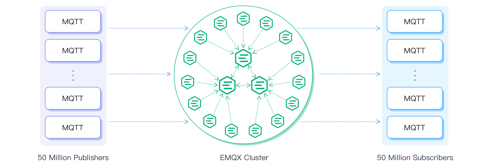
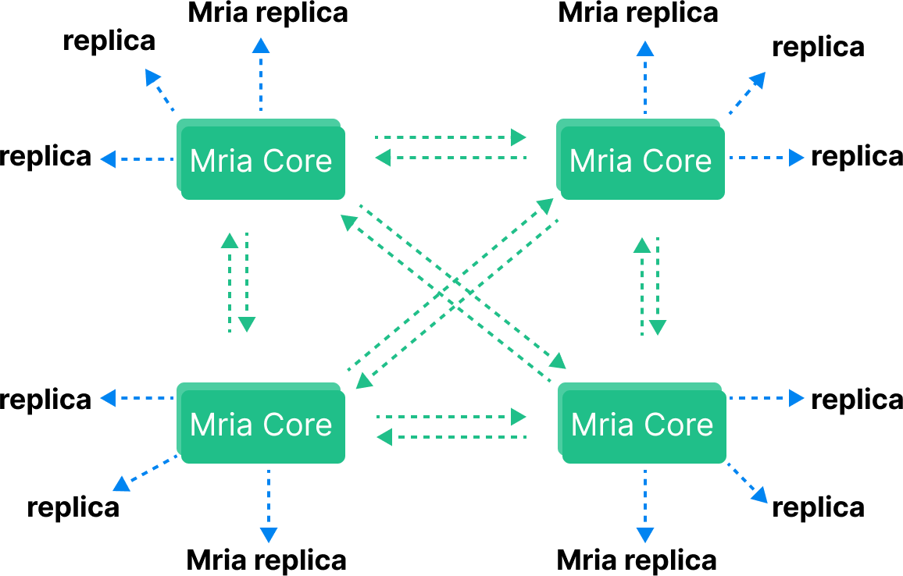

## Introduction

EMQX is an open-source, highly scalable, and feature-rich MQTT broker designed for IoT and real-time messaging applications.
It supports up to 100 million concurrent IoT device connections per cluster while maintaining a throughput
of 1 million messages per second and a millisecond latency.

EMQX supports various protocols, including MQTT (3.1, 3.1.1, and 5.0), HTTP, QUIC, and Web Socket.
It also provides secure bidirectional communication with MQTT over TLS/SSL and various authentication mechanisms,
ensuring reliable and efficient communication infrastructure for IoT devices and applications.

## How Clustering in EMQX Work?

The basic function of a distributed EMQX cluster is to forward and publish messages to different subscribers.
In previous versions, EMQX utilizes Erlang/OTP's built-in database, _Mnesia_, to store MQTT session states.
The database replication channel is powered by the **Erlang distribution** protocol, enabling each node to function
as both a client and server. The default listening port number for this protocol is _4370_.



However, the full mesh topology imposes a practical limit on the cluster size. For EMQX versions prior to 5,
it is recommended to keep the cluster size under 5 nodes. Beyond this, vertical scaling, which involves using
more powerful machines, is a preferable option to maintain the cluster's performance and stability.

To provide our customers with a better cluster salability performance, EMQX 5.0 adopts a new **Mria** cluster architecture.
With this Mria architecture, one EMQX cluster can support up to 100 million concurrent MQTT connections.



## Architecture

EMQX 5.0 redesigns the cluster architecture with Mria, which significantly improves EMQX's horizontal scalability. The new design supports 100,000,000 MQTT connections with a single cluster.



In this Mria, each node assumes one of two roles: **Core node** or **Replicant**. Core nodes serve as a data layer for the database. Replicant nodes connect to Core nodes and passively replicate
data updates from Core nodes.

By default, all nodes assume the Core node role, so the cluster behaves like that in EMQX 4.x, which is recommended for a small cluster with 3 nodes or fewer.
The Core + Replicant mode is only recommended if there are more than 3 nodes in the cluster.

### Enable Core + Replicant Mode

To enable the Core + Replicant mode, the backend database (`db_backend`) should be set to `rlog`, some nodes should assume the replicant role (`node.db_role`),
and the core node (`core_node`) should be specified, as shown below:

```bash
node {
    ##To set a node as a replicant node
 db_role = replicant
}
cluster {
  ## Default setting, suitable for very large backend
 .db_backend = rlog
  ##List of core nodes that the replicant will connect to, different nodes can be separated with a comma
  core_nodes = "emqx1@192.168.0.1, emqx2@192.168.0.2 ..."
}
```

## EMQX Clustering

MQTT is a stateful protocol, which means the broker needs to maintain state information about each MQTT session including
subscribed messages and unfinished message transmissions.

:::note
One of the biggest challenges of MQTT broker clustering is
ensuring that the clustered nodes are able to synchronize and replicate such states efficiently and reliably.
:::
