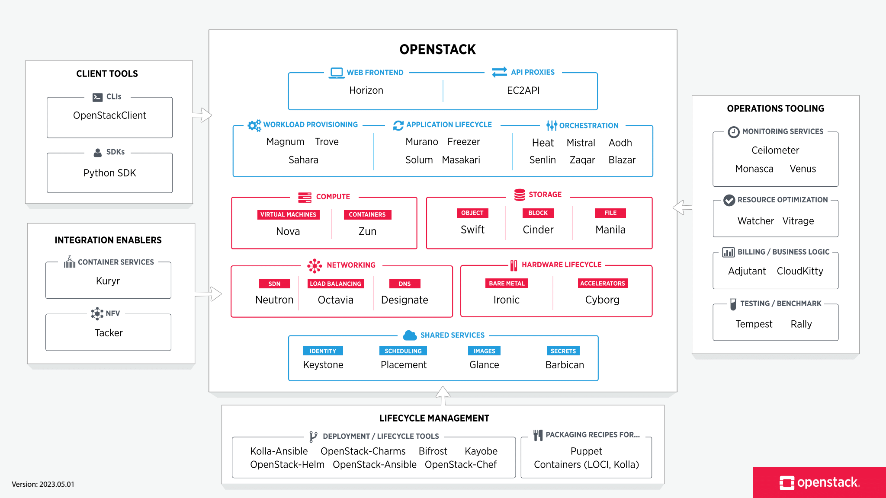

OpenStack is a cloud operating system that controls large pools of compute, storage, and networking resources
throughout a datacenter, all managed and provisioned through APIs with common authentication mechanisms.

OpenStack is broken up into services to allow you to plug and play components depending on your needs.
The OpenStack map gives you an “at a glance” view of the OpenStack landscape
to see where those services fit and how they can work together.

It’s important to note that OpenStack technologies are independent of the hypervisor.
Support is implemented through the appropriate drivers in **Nova** project.

**Keystone**, OpenStack’s identification service, is a centralized catalog of users and services they can access.
Keystone perms as united authentication system of the cloud operating system.

**Glance**, OpenStack’s image service, runs the catalog of virtual machines’ images,
which users can use as templates to run instances of virtual machines in the cloud.

**Cinder**, OpenStack’s _block storage_ service, can be used by running instances of virtual machines.
This is permanent data storage for virtual machines.
Snapshots can be used for data saving and restoring or cloning.
In most cases, data storage based on GNU/Linux servers is used together with Cinder.

**Swift**, OpenStack’s _object storage_ service. This service allows users to store files.

**Ceilometer**, OpenStack’s telemetry service, is a centralized information source based on cloud metrics for monitoring data.

Heat, OpenStack’s orchestration service, has the main task of application life cycle provision in cloud infrastructure.

Horizon, OpenStack’s dashboard service, allows management of cloud resources through the web console.

## Test Environment

[MicroStack](https://microstack.run/) allows you to create an OpenStack test lab. It is a Canonical project based on the snap tool.

## Deployment

Kolla-Ansible deploys a containerised OpenStack control plane using Kolla containers, orchestrated via Ansible. The project aims for simplicity and reliability, while providing a flexible, intuitive configuration model.

[Kolla - OpenStack](https://wiki.openstack.org/wiki/Kolla)

[TripleO - OpenStack](https://wiki.openstack.org/wiki/TripleO)
